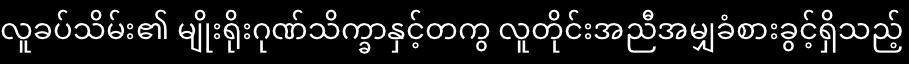

<div align="right">
  <details>
    <summary >🌐 Language</summary>
    <div>
      <div align="center">
        <a href="https://openaitx.github.io/view.html?user=JimmyLefevre&project=kb&lang=en">English</a>
        | <a href="https://openaitx.github.io/view.html?user=JimmyLefevre&project=kb&lang=zh-CN">简体中文</a>
        | <a href="https://openaitx.github.io/view.html?user=JimmyLefevre&project=kb&lang=zh-TW">繁體中文</a>
        | <a href="https://openaitx.github.io/view.html?user=JimmyLefevre&project=kb&lang=ja">日本語</a>
        | <a href="https://openaitx.github.io/view.html?user=JimmyLefevre&project=kb&lang=ko">한국어</a>
        | <a href="https://openaitx.github.io/view.html?user=JimmyLefevre&project=kb&lang=hi">हिन्दी</a>
        | <a href="https://openaitx.github.io/view.html?user=JimmyLefevre&project=kb&lang=th">ไทย</a>
        | <a href="https://openaitx.github.io/view.html?user=JimmyLefevre&project=kb&lang=fr">Français</a>
        | <a href="https://openaitx.github.io/view.html?user=JimmyLefevre&project=kb&lang=de">Deutsch</a>
        | <a href="https://openaitx.github.io/view.html?user=JimmyLefevre&project=kb&lang=es">Español</a>
        | <a href="https://openaitx.github.io/view.html?user=JimmyLefevre&project=kb&lang=it">Itapano</a>
        | <a href="https://openaitx.github.io/view.html?user=JimmyLefevre&project=kb&lang=ru">Русский</a>
        | <a href="https://openaitx.github.io/view.html?user=JimmyLefevre&project=kb&lang=pt">Português</a>
        | <a href="https://openaitx.github.io/view.html?user=JimmyLefevre&project=kb&lang=nl">Nederlands</a>
        | <a href="https://openaitx.github.io/view.html?user=JimmyLefevre&project=kb&lang=pl">Polski</a>
        | <a href="https://openaitx.github.io/view.html?user=JimmyLefevre&project=kb&lang=ar">العربية</a>
        | <a href="https://openaitx.github.io/view.html?user=JimmyLefevre&project=kb&lang=fa">فارسی</a>
        | <a href="https://openaitx.github.io/view.html?user=JimmyLefevre&project=kb&lang=tr">Türkçe</a>
        | <a href="https://openaitx.github.io/view.html?user=JimmyLefevre&project=kb&lang=vi">Tiếng Việt</a>
        | <a href="https://openaitx.github.io/view.html?user=JimmyLefevre&project=kb&lang=id">Bahasa Indonesia</a>
      </div>
    </div>
  </details>
</div>

# kb

[Single-header](https://github.com/nothings/stb/blob/master/docs/stb_howto.txt) permissively-licensed libraries for C/C++.

## Libraries

- [kb\_text\_shape.h](./kb_text_shape.h): Unicode text segmentation and OpenType shaping

## kb_text_shape.h





[kb\_text\_shape.h](./kb_text_shape.h) provides ICU-like text segmentation (i.e. breaking Unicode text by direction, line, word and grapheme). It also provides Harfbuzz-like text shaping for OpenType fonts, which means it is capable of handling complex script layout and ligatures, among other things.

It does **not** handle rasterization. It does **not** handle paragraph layout. It will only help you know which glyphs to display where on a single, infinitely-long line!

(See https://www.newroadoldway.com/text1.html for an explanation of the different steps of text processing.)

```c
static kbts_font GlobalFont;

void RenderGlyph(kbts_glyph *Glyph, int X, int Y); // Yours to implement

void ShapeText(kbts_cursor *Cursor, uint32_t *Codepoints, size_t CodepointCount, kbts_direction MainDirection, kbts_direction Direction, kbts_script Script)
{
  kbts_glyph *Glyphs = (kbts_glyph *)malloc(sizeof(kbts_glyph) * CodepointCount);

  for(size_t CodepointIndex = 0; CodepointIndex < CodepointCount; ++CodepointIndex)
  {
    Glyphs[CodepointIndex] = kbts_CodepointToGlyph(&GlobalFont, Codepoints[CodepointIndex]);
  }

  kbts_shape_state *State = kbts_CreateShapeState(&GlobalFont);
  kbts_shape_config Config = kbts_ShapeConfig(&GlobalFont, Script, KBTS_LANGUAGE_DONT_KNOW);

  uint32_t GlyphCount = CodepointCount;
  uint32_t GlyphCapacity = GlyphCount;
  while(kbts_Shape(State, &Config, MainDirection, Direction, Glyphs, &GlyphCount, GlyphCapacity))
  {
    Glyphs = (kbts_glyph *)realloc(sizeof(kbts_glyph) * State->RequiredGlyphCapacity);
    GlyphCapacity = State->RequiredGlyphCapacity;
  }

  for(size_t GlyphIndex = 0; GlyphIndex < GlyphCount; ++GlyphIndex)
  {
    kbts_glyph *Glyph = &Glyphs[GlyphIndex];

    int X, Y;
    kbts_PositionGlyph(Cursor, Glyph, &X, &Y);

    RenderGlyph(Glyph, X, Y);
  }

  free(Glyphs);
}

void SegmentText(uint32_t *Codepoints, size_t CodepointCount)
{
  kbts_cursor Cursor = {0};
  kbts_direction Direction = KBTS_DIRECTION_NONE;
  kbts_script Script = KBTS_SCRIPT_DONT_KNOW;
  size_t RunStart = 0;
  kbts_break_state BreakState;
  kbts_BeginBreak(&BreakState, KBTS_DIRECTION_NONE, KBTS_JAPANESE_LINE_BREAK_STYLE_NORMAL);
  for(size_t CodepointIndex = 0; CodepointIndex < CodepointCount; ++CodepointIndex)
  {
    kbts_BreakAddCodepoint(&BreakState, Codepoints[CodepointIndex], 1, (CodepointIndex + 1) == CodepointCount);
    kbts_break Break;
    while(kbts_Break(&BreakState, &Break))
    {
      if((Break.Position > RunStart) && (Break.Flags & (KBTS_BREAK_FLAG_DIRECTION | KBTS_BREAK_FLAG_SCRIPT | KBTS_BREAK_FLAG_LINE_HARD)))
      {
        size_t RunLength = Break.Position - RunStart;
        ShapeText(&Cursor, Codepoints + RunStart, RunLength, BreakState.MainDirection, Direction, Script);
        RunStart = Break.Position;
      }

      if(Break.Flags & KBTS_BREAK_FLAG_DIRECTION)
      {
        Direction = Break.Direction;
        if(!Cursor.Direction) Cursor = kbts_Cursor(BreakState.MainDirection);
      }
      if(Break.Flags & KBTS_BREAK_FLAG_SCRIPT)
      {
        Script = Break.Script;
      }
    }
  }
}
```
