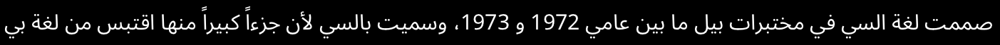
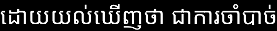
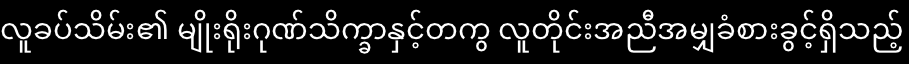

# kb

[Single-header](https://github.com/nothings/stb/blob/master/docs/stb_howto.txt) permissively-licensed libraries for C/C++.

## Libraries

- [kb\_text\_shape.h](./kb_text_shape.h): Unicode text segmentation and OpenType shaping

## kb_text_shape.h







[kb\_text\_shape.h](./kb_text_shape.h) provides:
- ICU-like text segmentation (i.e. breaking Unicode text by direction, line, script, word and grapheme).
- Harfbuzz-like text shaping for OpenType fonts, which means it is capable of handling complex script layout and ligatures, among other things.
- Font coverage checking: know if a font can display a given string.
- OpenType variable font support: shape with the right advances, metrics, kerning, and feature substitutions for any axis selection (`fvar`/`avar`/`HVAR`/`VVAR`/`MVAR`/`FeatureVariations`/GDEF `ItemVariationStore`).

It does **not** handle rasterization. It does **not** handle paragraph layout. It does **not** handle selection and loading of system fonts. It will only help you know which glyphs to display where on a single, infinitely-long line, using the fonts you have provided!

(See https://www.newroadoldway.com/text1.html for an explanation of the different steps of text processing.)

For an in-depth usage example, check out [refpad](https://github.com/JimmyLefevre/refpad).

```c
// Yours to provide:
void DrawGlyph(kbts_u16 GlyphId, kbts_s32 GlyphOffsetX, kbts_s32 GlyphOffsetY, kbts_s32 GlyphAdvanceX, kbts_s32 GlyphAdvanceY,
               kbts_direction ParagraphDirection, kbts_direction RunDirection, kbts_script Script, kbts_font *Font);
void NextLine(void);
void *CreateRenderFont(const char *FontPath);

void HandleText(kbts_shape_context *Context, const char *Text, kbts_language Language)
{
  kbts_ShapeBegin(Context, KBTS_DIRECTION_DONT_KNOW, Language);
  kbts_ShapeUtf8(Context, Text, (int)strlen(Text), KBTS_USER_ID_GENERATION_MODE_CODEPOINT_INDEX);
  kbts_ShapeEnd(Context);

  kbts_run Run;
  while(kbts_ShapeRun(Context, &Run))
  {
    if(Run.Flags & KBTS_BREAK_FLAG_LINE_HARD)
    {
      NextLine();
    }

    kbts_glyph *Glyph;
    while(kbts_GlyphIteratorNext(&Run.Glyphs, &Glyph))
    {
      DrawGlyph(Glyph->Id, Glyph->OffsetX, Glyph->OffsetY, Glyph->AdvanceX, Glyph->AdvanceY,
                Run.ParagraphDirection, Run.Direction, Run.Script, Run.Font);
    }
  }
}

void Example(void)
{
  kbts_shape_context *Context = kbts_CreateShapeContext(0, 0);
  kbts_font *FontA = kbts_ShapePushFontFromFile(Context, "NotoSansMyanmar-Regular.ttf", 0);
  kbts_font *FontB = kbts_ShapePushFontFromFile(Context, "NotoSansArabic-Regular.ttf", 0);

  FontA->UserData = CreateRenderFont("NotoSansMyanmar-Regular.ttf");
  FontB->UserData = CreateRenderFont("NotoSansArabic-Regular.ttf");

  HandleText(Context, (const char *)u8"یکအမည်မရှိیک", KBTS_LANGUAGE_ARABIC);
}
```

### Variable fonts

A variable font (e.g. `NotoSans[wdth,wght].ttf`) ships many design styles in
one .ttf. Pick a design point with `kbts_SetFontVariations`, passing a sparse
list of `(axis-tag, user-value)` pairs in 16.16 fixed:

```c
kbts_font Font = kbts_FontFromFile("NotoSans[wdth,wght].ttf", 0, 0, 0, &FileData, &FileSize);

// Bold, semi-condensed.
kbts_axis_value Values[] = {
  { KBTS_FOURCC('w','g','h','t'), 700 << 16 },
  { KBTS_FOURCC('w','d','t','h'), (87 << 16) | 32768 }, // 87.5
};
kbts_SetFontVariations(&Font, Values, 2);

// Subsequent shapes pick up advances, metrics, kerning, and feature swaps for the new design point.
```

`kbts_FontVariationAxisCount` / `kbts_GetFontVariationAxis` enumerate the
available axes; `kbts_GetFontVariationInstance` walks the `fvar` named
instances if you'd rather pick by name.
